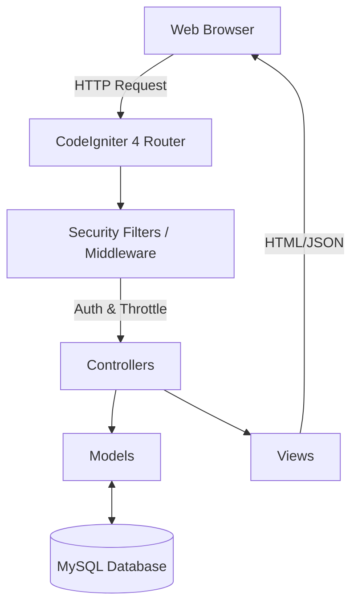
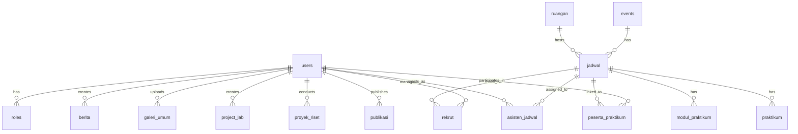

# SSIP IF ITENAS Laboratory Information System


## 📖 Project Overview
The **Smart System and Information Processing (SSIP)** Laboratory Information System at Institut Teknologi Nasional (ITENAS) Bandung is a laboratory operational management platform built using a monolithic CodeIgniter 4 architecture. This system is designed to manage assistant data, practicum schedules, lecturer research, scientific publications, and new assistant recruitment in an integrated manner.

---

## 🚀 Key Features

This system supports strict *Role-Based Access Control (RBAC)* for three main roles: **Admin (Head of Lab)**, **Assistant**, and **Lecturer**.

### 1. Membership & Role Management
- User data management with specific roles.
- Active laboratory period management.
- List of active assistants per period.

### 2. Practicum Operations
- **Schedules**: Setting schedules for laboratory activities (Practicum, Seminars, Meetings) complete with room and time information.
- **Practicum Modules**: Upload and manage learning modules in digital format (PDF).
- **Participants**: Monitoring the graduation status of practicum participants.

### 3. Research & Development
- **Lab Projects**: Internal laboratory project management, including tracking technologies used and team members.
- **Research Projects**: Documentation of lecturer research which includes partners, funding sources, and implementation status.
- **Scientific Publications**: Catalog of publications (Journals, Proceedings, Patents) produced by the lab community.

### 4. Information & Communication
- **News**: Publication of announcements, seminars, and workshops.
- **Gallery**: Documentation of laboratory activities in photo and video formats.
- **Recruitment**: New assistant registration system integrated with specific schedules and requirements.
- **Vision & Mission**: Laboratory profile information page.

---

## 🏗️ System Architecture (local/development)

The system follows a standard monolithic MVC architecture based on CodeIgniter 4.



---

## ☁️ System Architecture (cloud/production)

Not configured. <!-- Add cloud architecture diagram -->

---

## 🛠️ Tech Stack

- **Backend Framework**: PHP CodeIgniter 4.x
- **Database**: MySQL / MariaDB 10.4+
- **Security**: 
  - Authentication: Session & JWT (firebase/php-jwt).
  - RBAC: Custom Filter/Middleware for route protection based on `role_id`.
- **Testing**: PHPUnit 10.5 with *Feature Testing* and *Database Migration*.
- **Operating System Development**: Ubuntu Linux.

---

## 📊 Database Table Relationship Diagram (TRD/ERD)

The system uses a robust relational schema with strict data integrity (Foreign Keys). 



| Table | Description |
|-------|-----------|
| `users` | Stores NRP, Name, Phone Number, and encrypted password. |
| `roles` | Role definition (Admin, Assistant, Lecturer, Practitioner). |
| `jadwal` | Time and room management for each event. |
| `berita` | Laboratory news content and announcements. |
| `rekrut` | Laboratory assistant vacancy settings. |
| `project_lab` | Details of internal lab projects and technologies used. |
| `proyek_riset` | Documentation of lecturer research and partner collaborations. |
| `publikasi` | Collection of published scientific works. |

---

## ⚙️ Getting Started / Installation

Follow these steps to run the project in a local environment (Ubuntu):

1. **Clone Repository**
   ```bash
   git clone https://github.com/username/SSIP_IF_ITENAS.git
   cd SSIP_IF_ITENAS
   ```

2. **Install Dependencies**
   ```bash
   composer install
   ```

3. **Environment Setup**
   Copy the `.env.example` file to `.env` and configure your database settings:
   ```env
   database.default.hostname = localhost
   database.default.database = ssip
   database.default.username = root
   database.default.password = your_password
   database.default.DBDriver = MySQLi

   # JWT Secret (Minimum 32 characters)
   JWT_SECRET = rahasia_keamanan_sistem_ssip_lab_itenas_2026_aman!
   ```

4. **Migration & Seeding Database**
   ```bash
   php spark migrate
   php spark db:seed DatabaseSeeder
   ```
   
5. **Run the Application**
   ```bash
   php spark serve
   ```

---

## 🔄 CI/CD & Deployment

Not configured. <!-- Add CI/CD details -->

---

## 🛡️ Progress Report: Security Maturation & QA Automation (SSIP IF ITENAS)

This document summarizes all traces, codebase modifications, and architectural achievements that we have carried out in pair-programming to raise the quality standard of the SSIP Lab system to become *Enterprise-Ready*.

### 1. QA Agent AI Implementation (Automated Testing)
To prevent regressions (recurring bugs) and ensure data integrity, we have integrated an autonomous testing agent system:
*   **`QaReportGenerator.php`**: Core library responsible for executing test scenarios.
*   **`QaAgentScan.php`**: Command-Line Interface (CLI) in CI4 to trigger the QA agent to run scans periodically.

### 2. Role Logic Refactoring & CRUD Stability
Aligning backend authorization to purely rely on CI4 filters and cleaning up potential fatal errors.
*   **Role-Conflict Resolution**: Removed manual role blockades (`if role_id != X`) that previously conflicted with `Routes.php`. Access for Head of Lab, Lecturers, and Assistants is now smooth in modules:
    *   `ProyekRisetController.php` (Supports Main Author & Co-Author integration)
    *   `PublikasiController.php`
    *   `JadwalController.php`
    *   `SertifikatController.php`
*   **Exception Handling (Graceful Fails)**: Injected `try-catch` blocks and `is_numeric($id)` validation evenly into `BeritaController`, `EventsController`, `PeriodeController`, `GaleriUmumController`, and `ModulPraktikumController` to ensure the server no longer throws red error screens upon Query failures or Foreign Key Constraints.

### 3. Critical Security Patching (Security Patch)
Executing the Technical Architect's recommendations to close three main cyber attack vectors:
*   **[MITIGATED] Brute-Force Attacks**: 
    *   Created **`ThrottleFilter.php`** (Limits attempts to the API login route to a maximum of 5 times per minute per IP).
    *   Registered in `Filters.php` and `Routes.php`.
*   **[MITIGATED] CSRF Exploitation on Logout**: 
    *   Secured `Routes.php` by changing the `logout` route to `POST`.
    *   Destroyed the Forced Logout execution loophole via URL by embedding a hidden form along with `csrf_field()` on the navigation UI in **`header.php`**.
*   **[MITIGATED] Stored XSS (Cross-Site Scripting)**: 
    *   Sanitized dynamic output variables. Wrapped risky values like user slash text with the `esc()` function in interface files, specifically in `jadwal_card_admin.php` and `rekrutmen_admin.php`.

All security work in this iteration is declared complete with a predicate of **100% SUCCESS**.

---

## 📜 License

[MIT License](LICENSE)
